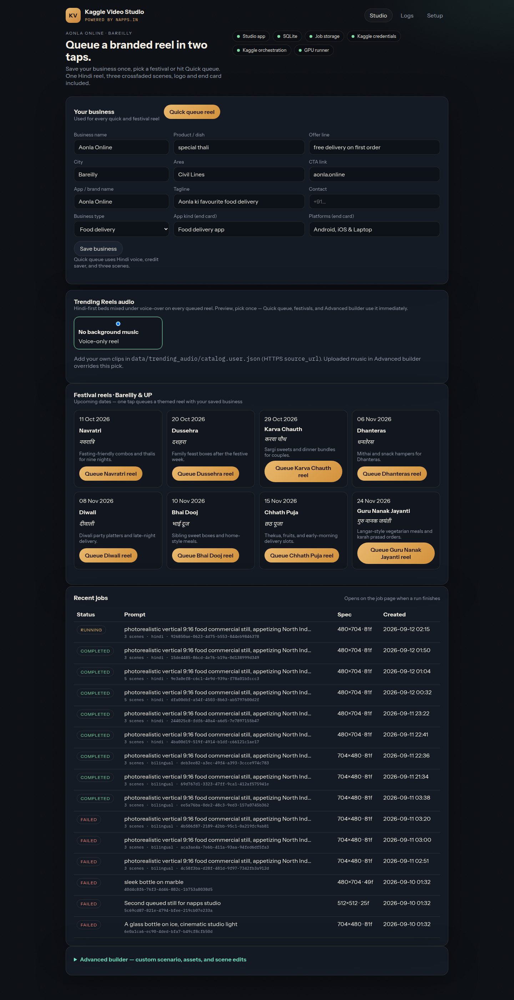
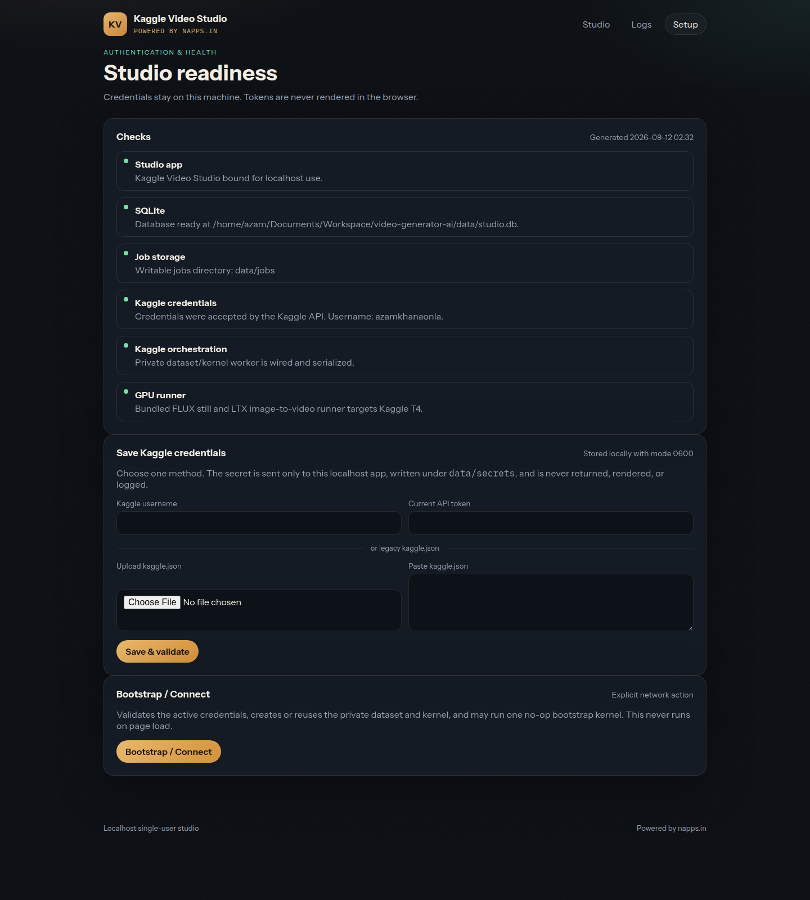
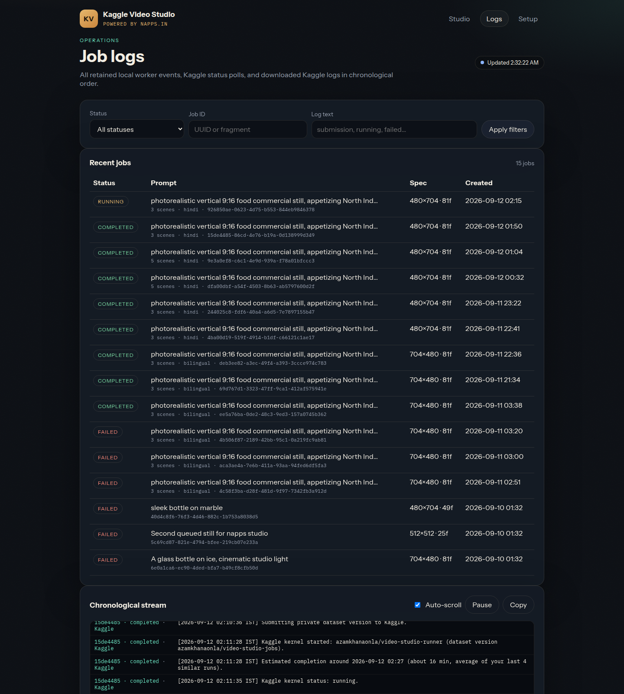
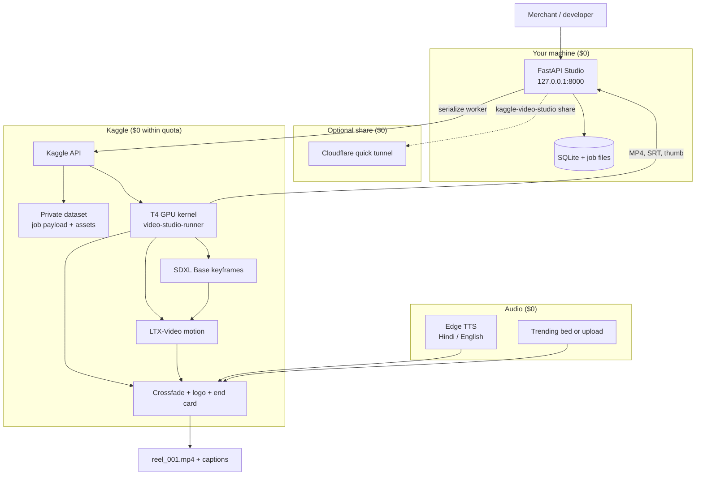

# AI Reels Post for Ecommerce (Free)

**Free, open-source studio to generate high-quality Instagram-style reels for ecommerce and local businesses**—food delivery, restaurants, sweets, shops, and services. Queue Hindi/English voice-over reels from your browser, render on **Kaggle’s free GPU (T4)**, and download one crossfaded vertical video with logo, end card, thumbnail, and sidecar captions.

[](LICENSE)
[](CONTRIBUTING.md)
[](https://napps.in)

> **$0 software stack.** You pay nothing for this repo. GPU time comes from your **Kaggle quota** (free tier). Voice uses **Microsoft Edge TTS**. Optional public sharing uses a **Cloudflare quick tunnel** (no account). Commercial use is allowed under the [MIT License](LICENSE)—keep the license notice in distributions.

**Repository:** [github.com/MOHDaazam/ai-reels-post-for-ecommerce-free](https://github.com/MOHDaazam/ai-reels-post-for-ecommerce-free)

---

## Why this exists

Merchants in India (Bareilly, UP, and beyond) need **Reels-ready promos** without a video editor or ad agency. This project wires together **free compute and free TTS** so one person can:

- Save a **business profile** once (name, dish, offer, city, CTA).
- Tap **Quick queue** or a **festival offer** (Navratri, Diwali, Holi, …).
- Pick **trending Reels-style background music** (Hindi-first catalog).
- Get a **single delivered reel** (3–6 crossfaded shots), not three separate files.

Developers are invited to extend templates, languages, and integrations—**pull requests welcome** ([CONTRIBUTING.md](CONTRIBUTING.md)).

---

## Screenshots

| Studio home — profile, trending audio, festivals, jobs | Kaggle setup |
| --- | --- |
|  |  |

| Job logs |
| --- |
|  |

---

## Sample reel

Completed **biryani_craving** run (job `9e3a0ef8…`, six crossfaded shots, Hindi voice-over, end card — Aonla). GitHub only renders an inline player when the video is hosted on **`github.com/user-attachments`** (not repo paths); see [Attaching files](https://docs.github.com/en/get-started/writing-on-github/working-with-advanced-formatting/attaching-files).

<p align="center">
  <video
    width="360"
    controls
    playsinline
    preload="metadata"
    poster="https://github.com/user-attachments/assets/afca81b7-8cbe-4189-b16e-b5587b566610"
    src="https://github.com/user-attachments/assets/e482f15d-5140-4afb-92e2-dbd07820a195">
  </video>
</p>

---

## Architecture



**Flow in plain language:** the studio stores jobs locally, uploads inputs to a **private Kaggle dataset**, runs a **pinned runner script** on a GPU kernel, then pulls outputs back into `data/jobs/<id>/`.

---

## $0 cost model

| Component | Cost | Notes |
| --- | --- | --- |
| This software | **$0** | MIT, commercial use OK |
| Local studio | **$0** | Python + SQLite on your PC |
| Kaggle GPU | **$0** within quota | T4; quotas and limits set by Kaggle |
| Edge TTS | **$0** | Network required on kernel |
| SDXL / LTX weights | **$0** | Downloaded on Kaggle session |
| Public URL (optional) | **$0** | `share` + Cloudflare; laptop must stay on |
| Instagram trending audio | **Curated beds** | Extend via `data/trending_audio/catalog.user.json`; respect copyright for commercial posts |

---

## Quick start (development)

**Requirements:** Python 3.11+, Kaggle account with API access, local disk for `data/`.

```bash
git clone https://github.com/MOHDaazam/ai-reels-post-for-ecommerce-free.git
cd ai-reels-post-for-ecommerce-free

python3 -m venv .venv
source .venv/bin/activate
python -m pip install --upgrade pip
pip install -e ".[test]"

cp .env.example .env
# Optional: KAGGLE_USERNAME + KAGGLE_API_TOKEN in .env
```

**Run the studio:**

```bash
kaggle-video-studio
# open http://127.0.0.1:8000
```

**One-time Kaggle setup:** open [Setup](http://127.0.0.1:8000/setup) → save credentials → **Bootstrap / Connect** (creates/reuses private dataset + kernel).

**Share from your laptop (optional, no hosting bill):**

```bash
# install cloudflared once — see .env.example / docs in app/share.py
kaggle-video-studio share
```

**Tests:**

```bash
pytest
```

---

## Features (ecommerce-focused)

- **Business profile** — reuse vendor, dish, offer, city, CTA on every campaign.
- **Festival queue** — Bareilly / North India calendar with one-tap themed reels.
- **Trending Reels audio** — Hindi-first catalog; mixed under voice-over on export.
- **One reel per job** — crossfaded shots, credit saver (3) / balanced (4) / unique (6).
- **Brand-safe delivery** — no burned-in caption spam; logo bottom-right; dynamic **end card** (`app_name`, platforms, CTA URL); **thumbnail** + **SRT**.
- **Campaign builder** — advanced scenarios, assets, and scene edits (collapsed in UI).

---

## FAQ (for search & answer engines)

**Is AI Reels Post for Ecommerce really free?**  
Yes. The code is free (MIT). Rendering uses Kaggle GPU time from your account’s free quota, not a paid API from this repo.

**Can I use generated reels commercially?**  
Yes, under the MIT license for the software. You are responsible for music, likeness, and platform rules (Instagram/Meta).

**Do I need a paid GPU cloud?**  
No. The default path is **Kaggle T4**. No Fly.io or AWS required.

**Does it work for non-food businesses?**  
Yes. Set **business type** in the profile; templates cover delivery, restaurant, sweets, and general services—PRs add more verticals.

**How is Hindi supported?**  
Edge TTS Indian voices; Devanagari-friendly brand cards; festival copy in Hindi and English metadata.

**How do developers contribute?**  
Fork → branch → PR. See [CONTRIBUTING.md](CONTRIBUTING.md). Maintainers welcome collaborators who improve templates, docs, and zero-cost pipeline reliability.

---

## Project layout

| Path | Purpose |
| --- | --- |
| `app/` | FastAPI studio, UI, jobs, campaigns, trending audio |
| `kaggle_runner/run.py` | GPU pipeline (only file synced to Kaggle kernel) |
| `data/` | Local jobs, secrets, profiles (gitignored) |
| `docs/screenshots/` | README visuals |

---

## Security notes

- Single-user **localhost** tool; optional tunnel exposes the UI—anyone with the URL can queue jobs.
- Kaggle credential changes are **localhost-only** by design.
- Never commit `.env` or `data/secrets/kaggle.json`.

---

## License

[MIT License](LICENSE) — Copyright (c) 2026 Mohd Azam. Free for commercial and personal use; include the license text in copies.

---

## Connect & contribute

- **Star** the repo if it helps your shop or agency.
- **Open a PR** — bugfixes, templates, docs, translations ([CONTRIBUTING.md](CONTRIBUTING.md)).
- **Invite collaborators:** maintainers can add developers via GitHub → Settings → Collaborators on [this repository](https://github.com/MOHDaazam/ai-reels-post-for-ecommerce-free).

Built with care for **zero-budget ecommerce marketing** and **open collaboration**. **Powered by [napps.in](https://napps.in).**
